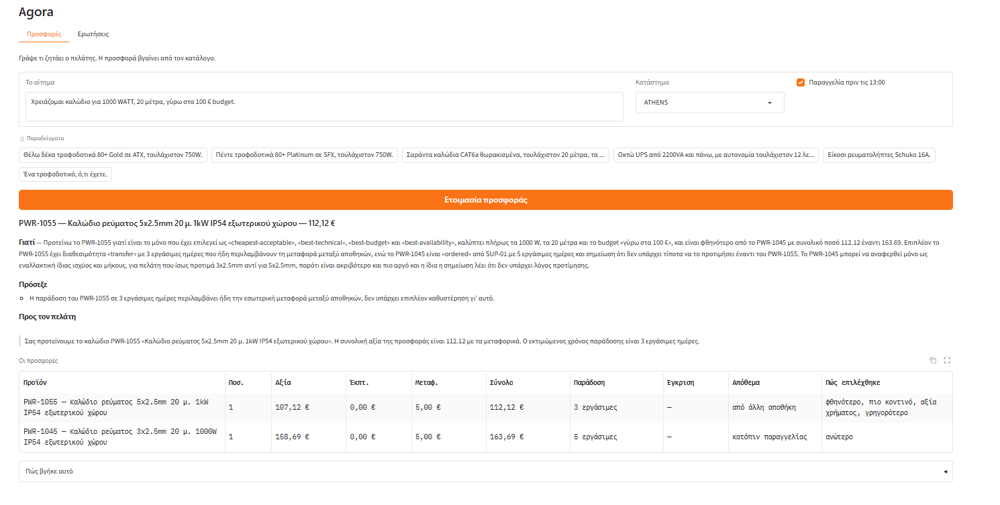

# Καλώδιο με budget

Κατηγορία, δύο τεχνικές απαιτήσεις και ένα budget από μία πρόταση. Χτίστηκαν δύο σενάρια και τα δύο βγήκαν πάνω από τα 100 € ανά μονάδα: ο έλεγχος το κατέγραψε ως προειδοποίηση και δεν απέσυρε τις προσφορές, γιατί μια προσφορά εκτός budget είναι του πωλητή να την κρίνει και όχι του συστήματος να την κρύψει.

**Το αίτημα** — κατάστημα Αθήνα, παραγγελία πριν τις 13:00

> Χρειάζομαι καλώδιο για 1000 WATT, 20 μέτρα, γύρω στα 100 € budget.

## Η απάντηση

### PWR-1055 — Καλώδιο ρεύματος 5x2.5mm 20 μ. 1kW IP54 εξωτερικού χώρου — 112,12 €

**Γιατί** — Προτείνω το PWR-1055 γιατί, σύμφωνα με τις σημειώσεις, καλύπτει όλες τις προϋποθέσεις του πελάτη (1000 W, 20 μέτρα, budget γύρω στα 100 €) και είναι η φθηνότερη αποδεκτή λύση με συνολικό ποσό 112.12 και χρόνο παράδοσης 3 εργάσιμες ημέρες, όπου οι 3 ημέρες περιλαμβάνουν ήδη τη μεταφορά μεταξύ αποθηκών. Το PWR-1045 είναι ακριβότερο με συνολικό ποσό 163.69, έχει μεγαλύτερο χρόνο παράδοσης 5 εργάσιμες ημέρες, και η ίδια η σημείωση του αναφέρει ότι δεν υπάρχει τίποτα να το προτιμήσει έναντι του PWR-1055, αφού το PWR-1055 είναι φθηνότερο, τουλάχιστον το ίδιο γρήγορο και καλύπτει εξίσου το αίτημα.

**Πρόσεξε**
- οι 3 εργάσιμες ημέρες παράδοσης περιλαμβάνουν ήδη τη μεταφορά μεταξύ αποθηκών

**Προς τον πελάτη**

> Σας προτείνουμε το καλώδιο ρεύματος PWR-1055, 5x2.5mm, 20 μ., για φορτίο 1kW, κατάλληλο για εξωτερικό χώρο (IP54). Η συνολική αξία της προσφοράς, μαζί με τα μεταφορικά, είναι 112.12. Ο εκτιμώμενος χρόνος παράδοσης είναι 3 εργάσιμες ημέρες. Οι 3 εργάσιμες ημέρες περιλαμβάνουν ήδη τη μεταφορά μεταξύ αποθηκών.

## Οι προσφορές

| Προϊόν | Ποσ. | Αξία | Έκπτ. | Μεταφ. | Σύνολο | Παράδοση | Έγκριση | Απόθεμα | Πώς επιλέχθηκε |
|---|---|---|---|---|---|---|---|---|---|
| PWR-1055 — Καλώδιο ρεύματος 5x2.5mm 20 μ. 1kW IP54 εξωτερικού χώρου | 1 | 107,12 € | 0,00 € | 5,00 € | 112,12 € | 3 εργάσιμες | — | από άλλη αποθήκη | φθηνότερο, πιο κοντινό, αξία χρήματος, γρηγορότερο |
| PWR-1045 — Καλώδιο ρεύματος 3x2.5mm 20 μ. 1000W IP54 εξωτερικού χώρου | 1 | 158,69 € | 0,00 € | 5,00 € | 163,69 € | 5 εργάσιμες | — | κατόπιν παραγγελίας | ανώτερο |

## Πώς βγήκε αυτό

**Τι κατάλαβε από το αίτημα**

**Κατηγορία** POWER

**Ισχύς (W)** 1000

**Μήκος (μ)** 20

**Τι βρήκε στον κατάλογο**

PWR-1045, PWR-1055

**Τι είπε ο έλεγχος**

| Προϊόν | Προσφέρεται | Τι δεν πέρασε |
|---|---|---|
| PWR-1055 | ναι | 107.12 a unit against a budget of 100.0 |
| PWR-1045 | ναι | 158.69 a unit against a budget of 100.0 |

## Η οθόνη

*Το ίδιο αίτημα από την οθόνη.*

Ολόκληρη η απάντηση της υπηρεσίας: [`raw/01-cable-with-a-budget.json`](raw/01-cable-with-a-budget.json)
