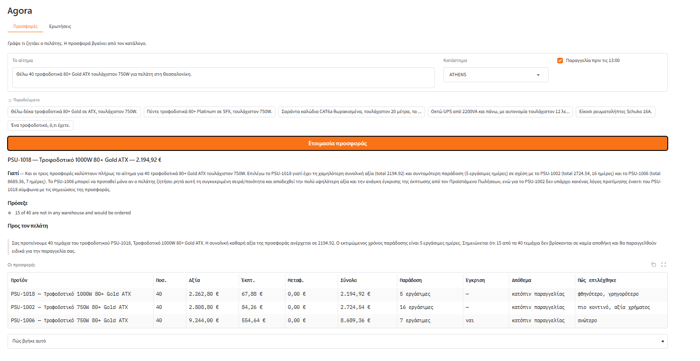

# Σαράντα τεμάχια και μια έγκριση

Η έκπτωση όγκου υπολογίζεται μόνη της από την αξία της παραγγελίας. Το ένα από τα τρία σενάρια πέφτει σε κλιμάκιο που ξεπερνά ό,τι υπογράφει ο πωλητής, το σημειώνει, και η σύσταση εξηγεί γιατί δεν το διάλεξε.

**Το αίτημα** — κατάστημα Θεσσαλονίκη, παραγγελία πριν τις 13:00

> Θέλω 40 τροφοδοτικά 80+ Gold ATX τουλάχιστον 750W για πελάτη στη Θεσσαλονίκη.

## Η απάντηση

### PSU-1018 — Τροφοδοτικό 1000W 80+ Gold ATX — 2.194,92 €

**Γιατί** — Και τα τρία προϊόντα καλύπτουν πλήρως την απαίτηση για 80+ Gold ATX τουλάχιστον 750W. Μεταξύ τους, το PSU-1018 είναι σαφώς φθηνότερο από τα PSU-1002 και PSU-1006, έχει μικρότερο συνολικό ποσό (2194.92 έναντι 2724.54 και 8689.36) και συντομότερο χρόνο παράδοσης (5 εργάσιμες ημέρες έναντι 16 για το PSU-1002 και 7 για το PSU-1006). Επιπλέον, δεν απαιτεί έγκριση προϊσταμένου, σε αντίθεση με το PSU-1006. Ως εναλλακτική, το PSU-1006 μπορεί να προταθεί μόνο αν ο πελάτης ζητήσει συγκεκριμένα αυτό το μοντέλο, γνωρίζοντας ότι είναι πολύ ακριβότερο, χρειάζεται έγκριση έκπτωσης και δεν προσφέρει ταχύτερη παράδοση από το PSU-1018.

**Πρόσεξε**
- 15 of 40 are not in any warehouse and would be ordered
- ordered from SUP-01

**Προς τον πελάτη**

> Σας προτείνουμε το τροφοδοτικό PSU-1018, 1000W 80+ Gold ATX, σε ποσότητα 40 τεμαχίων, με συνολική αξία παραγγελίας 2194.92. Ο εκτιμώμενος χρόνος παράδοσης είναι 5 εργάσιμες ημέρες. Σημειώνεται ότι 15 από τα 40 τεμάχια δεν βρίσκονται σε καμία αποθήκη και θα παραγγελθούν από τον προμηθευτή SUP-01.

## Οι προσφορές

| Προϊόν | Ποσ. | Αξία | Έκπτ. | Μεταφ. | Σύνολο | Παράδοση | Έγκριση | Απόθεμα | Πώς επιλέχθηκε |
|---|---|---|---|---|---|---|---|---|---|
| PSU-1018 — Τροφοδοτικό 1000W 80+ Gold ATX | 40 | 2.262,80 € | 67,88 € | 0,00 € | 2.194,92 € | 5 εργάσιμες | — | κατόπιν παραγγελίας | φθηνότερο, γρηγορότερο |
| PSU-1002 — Τροφοδοτικό 750W 80+ Gold ATX | 40 | 2.808,80 € | 84,26 € | 0,00 € | 2.724,54 € | 16 εργάσιμες | — | κατόπιν παραγγελίας | πιο κοντινό, αξία χρήματος |
| PSU-1006 — Τροφοδοτικό 750W 80+ Gold ATX | 40 | 9.244,00 € | 554,64 € | 0,00 € | 8.689,36 € | 7 εργάσιμες | ναι | κατόπιν παραγγελίας | ανώτερο |

## Πώς βγήκε αυτό

**Τι κατάλαβε από το αίτημα**

**Κατηγορία** PSU

**Ποσότητα** 40

**Απόδοση** 80+ Gold

**Μέγεθος** ATX

**Ισχύς (W)** τουλάχιστον 750

**Τι βρήκε στον κατάλογο**

PSU-1006, PSU-1018, PSU-1002, PSU-1032, PSU-1012

**Τι είπε ο έλεγχος**

| Προϊόν | Προσφέρεται | Τι δεν πέρασε |
|---|---|---|
| PSU-1018 | ναι | — |
| PSU-1002 | ναι | — |
| PSU-1006 | ναι | the sales manager has to approve the band before this goes out |

## Η οθόνη

*Το ίδιο αίτημα από την οθόνη, με το κατάστημα στην Αθήνα.*

Ολόκληρη η απάντηση της υπηρεσίας: [`raw/02-forty-units-and-an-approval.json`](raw/02-forty-units-and-an-approval.json)
