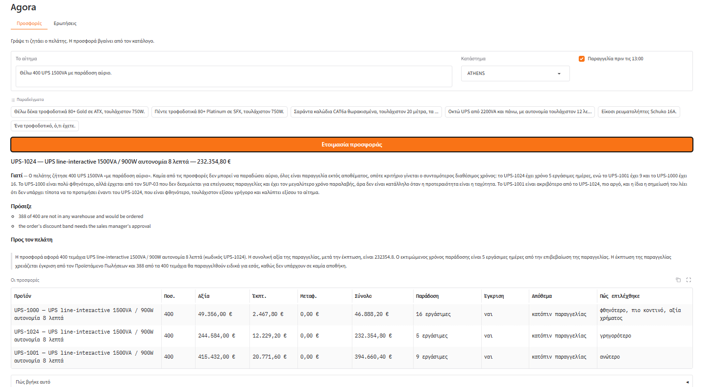

# Μια προθεσμία που δεν προλαβαίνεται

Ο πελάτης ζητάει τετρακόσια τεμάχια με παράδοση αύριο. Κανένα σενάριο δεν προλαβαίνει και το σύστημα δεν το παρακάμπτει: προτείνει τον συντομότερο χρόνο που υπάρχει και γράφει ότι το αύριο δεν γίνεται.

**Το αίτημα** — κατάστημα Αθήνα, παραγγελία πριν τις 13:00

> Θέλω 400 UPS 1500VA με παράδοση αύριο.

## Η απάντηση

### UPS-1024 — UPS line-interactive 1500VA / 900W αυτονομία 8 λεπτά — 232.354,80 €

**Γιατί** — Ο πελάτης ζήτησε 400 UPS 1500VA «με παράδοση αύριο». Καμία προσφορά δεν μπορεί να παραδώσει αύριο, όλες είναι «ordered», οπότε κρίνουμε με βάση τον μικρότερο διαθέσιμο χρόνο παράδοσης. Το UPS-1024 δίνει τα 400 τεμάχια με χρόνο 5 εργάσιμες ημέρες, ενώ το UPS-1001 χρειάζεται 9 ημέρες και το UPS-1000 16 ημέρες, άρα το UPS-1024 είναι η καλύτερη απάντηση σε επείγουσα ανάγκη. Το UPS-1000 είναι πολύ φθηνότερο, αλλά με 16 ημέρες και προμηθευτή SUP-03 που «δεν δεσμεύεται για επείγουσα παραγγελία», άρα δεν καλύπτει την ταχύτητα που ζητά ο πελάτης. Το UPS-1001 είναι ακριβότερο από το UPS-1024, πιο αργό (9 ημέρες) και οι ίδιες οι σημειώσεις του λένε ότι «τίποτα δεν το προτιμά έναντι του UPS-1024», οπότε δεν υπάρχει λόγος να το προτείνουμε ως εναλλακτική.

**Πρόσεξε**
- 388 of 400 are not in any warehouse and would be ordered
- the order's discount band needs the sales manager's approval

**Προς τον πελάτη**

> Σας προτείνουμε το UPS-1024, UPS line-interactive 1500VA / 900W αυτονομία 8 λεπτά, σε ποσότητα 400 τεμαχίων. Η συνολική αξία της προσφοράς είναι 232354.8 €. Ο εκτιμώμενος χρόνος παράδοσης είναι 5 εργάσιμες ημέρες από την επιβεβαίωση της παραγγελίας. Σημειώνουμε ότι 388 από τα 400 τεμάχια θα παραγγελθούν από τον προμηθευτή και ότι η έκπτωση της παραγγελίας χρειάζεται έγκριση από τον Προϊστάμενο Πωλήσεων.

## Οι προσφορές

| Προϊόν | Ποσ. | Αξία | Έκπτ. | Μεταφ. | Σύνολο | Παράδοση | Έγκριση | Απόθεμα | Πώς επιλέχθηκε |
|---|---|---|---|---|---|---|---|---|---|
| UPS-1000 — UPS line-interactive 1500VA / 900W αυτονομία 8 λεπτά | 400 | 49.356,00 € | 2.467,80 € | 0,00 € | 46.888,20 € | 16 εργάσιμες | ναι | κατόπιν παραγγελίας | φθηνότερο, πιο κοντινό, αξία χρήματος |
| UPS-1024 — UPS line-interactive 1500VA / 900W αυτονομία 8 λεπτά | 400 | 244.584,00 € | 12.229,20 € | 0,00 € | 232.354,80 € | 5 εργάσιμες | ναι | κατόπιν παραγγελίας | γρηγορότερο |
| UPS-1001 — UPS line-interactive 1500VA / 900W αυτονομία 8 λεπτά | 400 | 415.432,00 € | 20.771,60 € | 0,00 € | 394.660,40 € | 9 εργάσιμες | ναι | κατόπιν παραγγελίας | ανώτερο |

## Πώς βγήκε αυτό

**Τι κατάλαβε από το αίτημα**

**Κατηγορία** UPS

**Ποσότητα** 400

**Άμεσα** ναι

**Ισχύς (VA)** 1500

**Τι βρήκε στον κατάλογο**

UPS-1002, UPS-1005, UPS-1006, UPS-1024, UPS-1001, UPS-1000, UPS-1023, UPS-1013, UPS-1008

**Τι είπε ο έλεγχος**

| Προϊόν | Προσφέρεται | Τι δεν πέρασε |
|---|---|---|
| UPS-1000 | ναι | the sales manager has to approve the band before this goes out |
| UPS-1024 | ναι | the sales manager has to approve the band before this goes out |
| UPS-1001 | ναι | the sales manager has to approve the band before this goes out |

## Η οθόνη

*Το ίδιο αίτημα από την οθόνη.*

Ολόκληρη η απάντηση της υπηρεσίας: [`raw/03-a-deadline-that-cannot-be-met.json`](raw/03-a-deadline-that-cannot-be-met.json)
