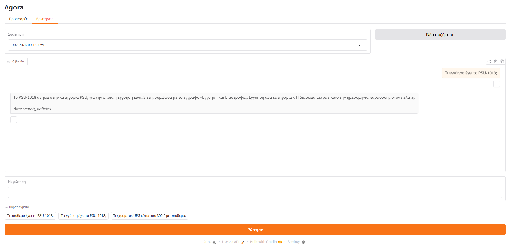

# Ερώτηση στα έγγραφα

Ερώτηση για όρο, όχι για προσφορά. Το μοντέλο διαλέγει μόνο του ποιο tool χρειάζεται, και η απάντηση αναφέρει το έγγραφο και την ενότητα από την οποία βγήκε.

**Ερώτηση** — Τι εγγύηση έχει το PSU-1018;

> Το PSU-1018 ανήκει στην κατηγορία PSU, για την οποία η εγγύηση είναι 3 έτη, σύμφωνα με το έγγραφο «Εγγύηση και Επιστροφές, Εγγύηση ανά κατηγορία». Η διάρκεια μετράει από την ημερομηνία παράδοσης στον πελάτη.

Tools: `search_policies` · γύροι: 2

## Η οθόνη

*Το ίδιο αίτημα από την οθόνη.*

Ολόκληρη η απάντηση της υπηρεσίας: [`raw/04-a-question-to-the-documents.json`](raw/04-a-question-to-the-documents.json)
