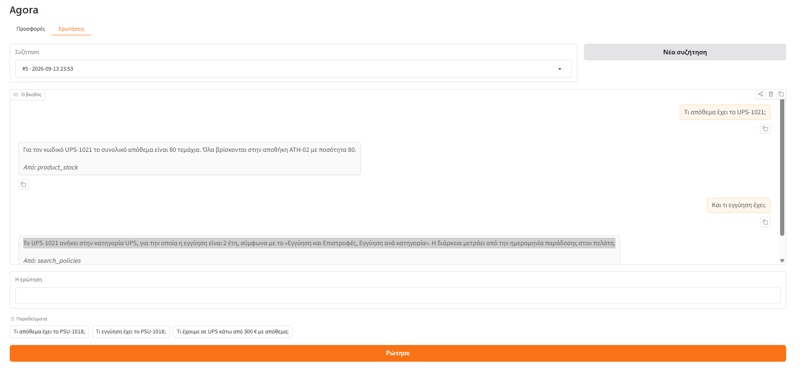

# Ερώτηση που συνεχίζει την προηγούμενη

Ο δεύτερος γύρος δεν ονομάζει προϊόν. Το υποκείμενο έρχεται από τον πρώτο, το νούμερο όμως όχι: η εγγύηση ζητήθηκε ξανά από τα έγγραφα αντί να γραφτεί από μνήμης.

**Ερώτηση** — Τι απόθεμα έχει το UPS-1021;

> Για τον κωδικό UPS-1021 το συνολικό απόθεμα είναι 80 τεμάχια. Όλα βρίσκονται στην αποθήκη ATH-02 με ποσότητα 80.

Tools: `product_stock` · γύροι: 2

**Ερώτηση** — Και τι εγγύηση έχει;

> Για τα UPS, σύμφωνα με το «Εγγύηση και Επιστροφές, Εγγύηση ανά κατηγορία», η εγγύηση είναι 2 έτη από την ημερομηνία παράδοσης στον πελάτη. Ισχύει για κατασκευαστικό ελάττωμα, όπως περιγράφεται στην ενότητα «Εγγύηση και Επιστροφές, Τι καλύπτει και τι όχι».

Tools: `search_policies` · γύροι: 2

Και οι δύο γύροι έγιναν στην ίδια συζήτηση, που είναι ο λόγος που ο δεύτερος δεν χρειάζεται να ονομάσει το προϊόν.

## Η οθόνη

*Το ίδιο αίτημα από την οθόνη.*

Ολόκληρη η απάντηση της υπηρεσίας: [`raw/05-a-follow-up-question.json`](raw/05-a-follow-up-question.json)
